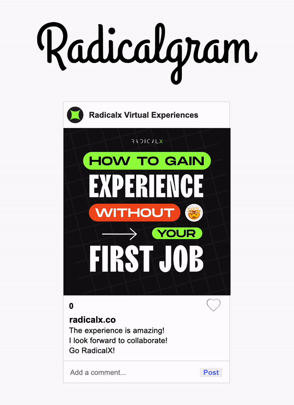

# Radicalgram

Today you'll be building an app for viewing, liking, and commenting on a single
picture. You will be using a local API and building out the frontend for our
app, Radicalgram.

## Demo

Use this gif as an example of how the app should work.



> To view in VSCode, right click on the README.md file and select "Open Preview".

## Setup

Run this command to get the backend started:

```sh
json-server --watch db.json --routes routes.json
```

**Make sure to run this command exactly as written**, otherwise your server will
not return data in the correct format. Test your server by visiting this route
in the browser:

[http://localhost:3000/images/1](http://localhost:3000/images/1)

Then, open the `index.html` file on your browser to run the application.

Write your code in the `src/index.js` file. The base URL for your API will be
[http://localhost:3000](http://localhost:3000).

## Deliverables

As a user, I can:

1. See the image received from the server, including its title, likes and
   comments when the page loads. You will need to make a GET request to the
   following endpoint to retrieve the image data, along with its associated
   comments:

   ```txt
   GET /images/1

   Example Response:
   {
     "id": 1,
     "title": "Radicalx Virtual Experiences",
     "likes": 0,
     "image": "./assets/radicalx_post.jpeg",
     "comments": [
       {
         "id": 1,
         "imageId": 1,
         "content": "Amazing experience!"
       },
       {
         "id": 2,
         "imageId": 1,
         "content": "I look forward to collaborating!"
       },
       {
         "id": 3,
         "imageId": 1,
         "content": "Go RadicalX!"
       }
     ]
   }
   ```

2. Click on the heart icon to increase image likes on the page. **No persistence
is needed**.

3. Add a new comment to the page when the comment form is submitted. **No
persistence is needed**.

### Bonus Deliverables

As a user, I can:

1. Remove a comment from the page when it is clicked. (Note: no persistence is
needed; it's fine if the comment shows up again when the page is refreshed)

2. Click the title of the image to toggle whether or not the image is being
displayed. Clicking once on the title of the image (`h2#card__title`) will hide the image element visually. Clicking on the title
again will display the image once more.

3. Click the image and see a new random image of a dog. Make a GET request to
this API to request a random color images:
[https://www.colourlovers.com/api/colors/random](https://www.colourlovers.com/api/colors/random)
Then replace the image of the colors with the new random image returned by the
API.
